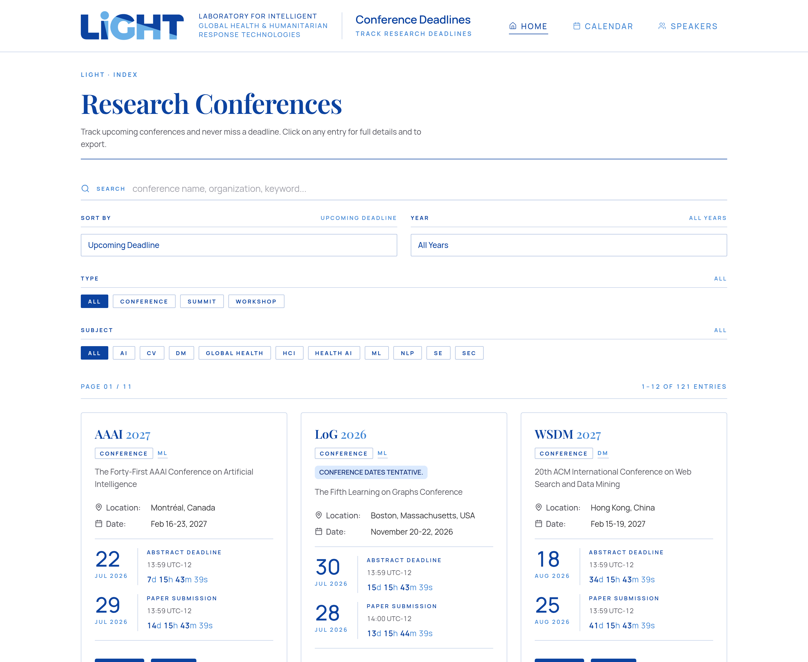
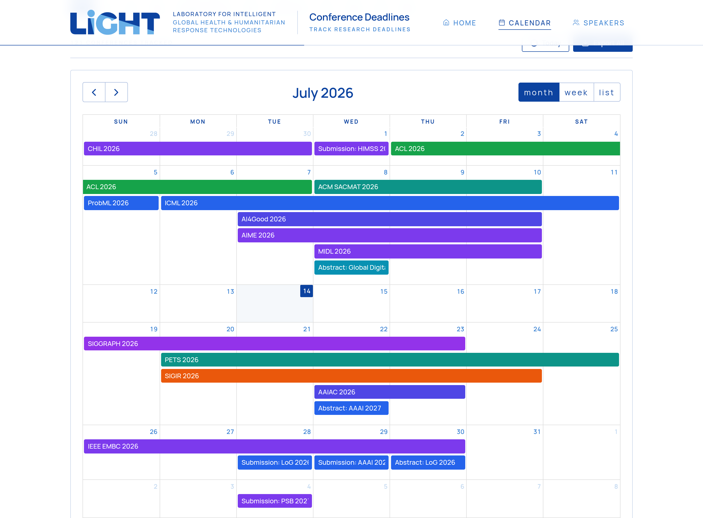
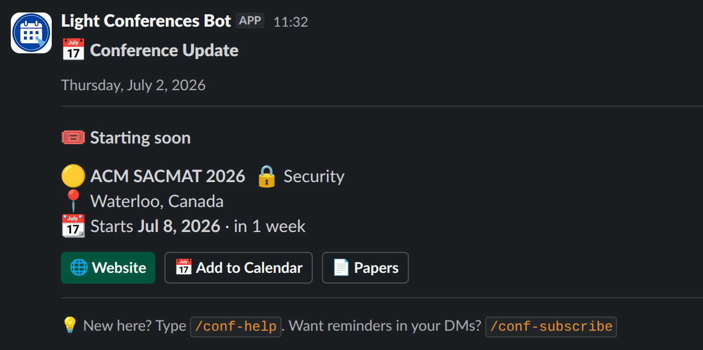
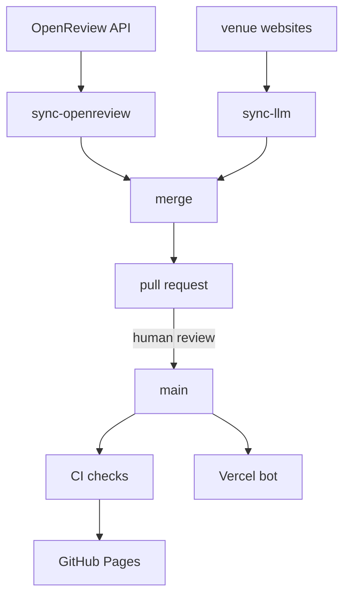

<div align="center">

# Conference Deadlines

**Track research conference deadlines across AI/ML and global health.**
Calendar, timezone-aware countdowns, search and filters, ICS export, and a Slack bot that reminds you before you miss one.

[**conferences.light-laboratory.org**](https://conferences.light-laboratory.org/)

[](https://github.com/EPFLiGHT/Conferences-Calendar/actions/workflows/ci.yml)
[](https://github.com/EPFLiGHT/Conferences-Calendar/actions/workflows/nextjs.yml)
[](LICENSE)
[](https://nextjs.org/)

<a href="https://conferences.light-laboratory.org/">
  
</a>

</div>

Built by [Omar Ziyad Azgaoui](https://github.com/AZOGOAT) at [LiGHT Lab](https://github.com/EPFLiGHT), EPFL.

## What it does

- **Deadline index.** Every tracked venue with a live countdown, in your own timezone. Search by name or keyword, filter by year, type and subject.
- **Calendar.** Month, week and list views covering conference dates and submission deadlines alike.
- **ICS export.** Export a single venue or the whole calendar into Google Calendar, Apple Calendar or Outlook.
- **Speakers page.** Lab members and the talks they are giving.
- **Slack bot.** Slash commands and opt-in DM reminders 30, 7 and 3 days before each deadline.

<div align="center">
  
</div>

## Slack bot

<div align="center">
  
</div>

Daily digests in a channel, reminders in your DMs, and slash commands to search venues. It installs into any
workspace via OAuth. Setup and command reference: [SLACK_BOT_README.md](SLACK_BOT_README.md).

## How it works

There is no database. Conferences are authored as YAML and deployed as static files with the rest of the
site; the browser fetches and parses them on page load. The Slack bot pulls the same files from the deployed
site through the same parser and caches the result in Vercel KV. Schema validation (`pnpm validate`) runs in
CI on every PR, so malformed data never reaches either consumer.

### Keeping deadlines fresh

Deadlines change all the time and updating them by hand gets old fast. Two weekly GitHub Actions handle it
instead. Neither one writes to the site directly: both open a pull request that a human merges.



The merge step is deliberately narrow. It writes only factual fields (`deadline`, `abstract_deadline`,
`full_name`, `place`, `start`, `end`, `date`) and never touches curated ones like `sub`, `note` or `link`.
Anything a venue's config pins with `sync_pin` is left alone, and a disagreement is reported in the PR body
rather than overwritten.

## Quickstart

The project uses pnpm.

```bash
pnpm install
pnpm dev              # dev server
pnpm validate         # check the YAML data (run after any data edit)
pnpm test             # tests
pnpm build            # production build
pnpm sync:openreview  # pull deadline updates from OpenReview
pnpm sync:llm         # pull health-venue deadlines from their websites
```

## Conference data

All events live in three YAML files under `public/data/`:

- `conferences.yaml`: academic conferences
- `summits.yaml`: industry summits
- `workshops.yaml`: workshops and smaller events

A fourth file, `speakers.yaml`, powers the Speakers page. It has its own format and is not checked by
`pnpm validate`.

### Schema

```yaml
- title: ShortName              # e.g. NeurIPS, CVPR
  year: 2025
  id: shortname25               # lowercase title + 2-digit year
  full_name: Full Conference Name
  link: https://conference-website.com
  deadline: 2025-05-21 20:00    # YYYY-MM-DD HH:MM
  abstract_deadline: 2025-05-14 20:00  # optional
  timezone: America/Los_Angeles # IANA timezone
  place: City, Country
  date: May 21-25, 2025
  start: 2025-05-21
  end: 2025-05-25
  paperslink: https://...
  hindex: 150.0                 # Google Scholar h5-index
  sub: ML                       # subject tag
  note: Additional information  # optional
  type: conference              # conference | summit | workshop
```

Only `title`, `year`, `id`, `type` and `timezone` are required. Missing fields show as "TBA". See the
[list of IANA timezones](https://en.wikipedia.org/wiki/List_of_tz_database_time_zones).

### Automated updates from OpenReview

Venues hosted on OpenReview (NeurIPS, ICML, ICLR, COLM, AAAI, CVPR, WACV, ECCV, LoG, UAI, MIDL, MLHC, CHIL)
are kept fresh by the weekly `pnpm sync:openreview` Action, which reads deadlines, dates and location from the
[OpenReview API](https://docs.openreview.net/). Hand edits to the synced fields of these venues get overwritten
by the next weekly PR; anything not covered by a sync (summits, workshops, venues in neither config) is
hand-maintained in the YAML. To sync another OpenReview venue, add one line to
`scripts/sync-openreview/venues.json`.

### Automated updates from venue websites

Most health conferences are not on OpenReview, so a second weekly Action (`pnpm sync:llm`) fetches each
venue's important-dates page and asks a small OpenAI model to pull out the deadlines. Every deadline has to
come with the exact sentence it was found in; the quote is checked against the page and shown in the PR body.
When a venue moves its dates page (they love doing this every year), a fallback agent finds the new one and
fixes `scripts/sync-llm/venues.json` in the same PR.

To run it locally, put `OPENAI_API_KEY=...` in `.env.local`. `--venue "<title>"` syncs a single venue,
`--dry-run` writes nothing. If a synced value keeps coming out wrong, pin it with `sync_pin: [full_name]` and
both syncs will leave that field alone.

## Stack

Next.js 16, React 19, TypeScript, Chakra UI v3, FullCalendar, Luxon, js-yaml. The site is a static export
deployed to GitHub Pages; the Slack API routes run on Vercel, with Vercel KV (Redis) backing bot state.

## Contributing

To add a conference, either
[open an issue](https://github.com/EPFLiGHT/Conferences-Calendar/issues/new/choose) with the details, or send
a PR:

1. Edit the right YAML file in `public/data/`
2. Run `pnpm validate`
3. Open a PR

Keep IDs lowercase (title plus 2-digit year, e.g. `neurips25`) and use a valid IANA timezone.

## License

MIT: see [LICENSE](LICENSE).

## Contact

[omarziyad.azgaoui2005@gmail.com](mailto:omarziyad.azgaoui2005@gmail.com)
